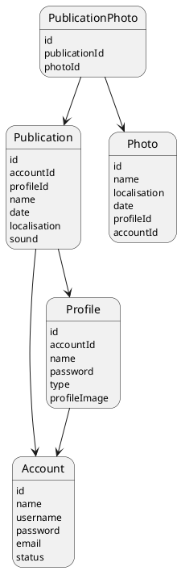

```plantuml
@startuml
Account : id
Account : name
Account : username
Account : password
Account : email
Account : status

Profile : id
Profile : accountId
Profile : name
Profile : password
Profile : type
Profile : profileImage

Publication: id
Publication: accountId
Publication: profileId
Publication: name
Publication: date
Publication: localisation
Publication: sound

Photo: id
Photo: name
Photo: localisation
Photo: date
Photo: profileId
Photo: accountId

PublicationPhoto: id
PublicationPhoto: publicationId
PublicationPhoto: photoId

PublicationPhoto --> Photo
PublicationPhoto --> Publication
Publication --> Profile
Publication --> Account
Profile --> Account

@enduml

```

